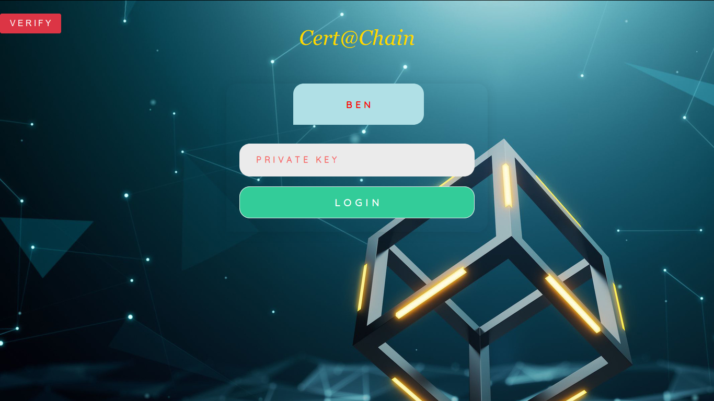

# Cert@Chain
#### * A Blockchain Powered Certificate Issuance and Verification System *
<p align="right">
  
</p>

## **Overview**
---
		The proposed solution (Cert@Chain) is a blockchain network, created by the Academic Institute (BEN). Institutes that are approved for issuance of certifcate are registered in the network by the main Institute (BEN), and those institutes are permitted to add the certificates. These institutes can also delete the certificates incase of any modification needed. All Institutes, which have been approved can view the log of all certificates added in the Cert@Chain system. Also, the students can verify their certificate easily.


## **Description**
---
		Cert@Chain is a blockchain powered certficate issuance and verification system that has been implemented on Hyperledger Sawtooth.
	
		Hyperledger Sawtooth, being an open-source business blockchain, is suitable for this scenario. The network being Byzantine Fault-tolerant, ensures that the network is kept up and running even if a node is not online or is disconnected. The permissioning (policies and roles) in Sawtooth ensures that there is control over who is allowed to do what kind of transactions.


## **Components**
---
1. **Client** : The client application is developed using Express & Node.js, with Handlebars templates for the web pages.

2. **Transaction Processor** : The Cert@Chain consists of only one Transaction Processor. The transaction processor is developed in Javascript.


## **Users**
---
1. **Institutes under BEN** : The Institute approved by BEN, can view all the certificate details of students.

2. **Students** : The students can verify their own certificate details.


## **System Requirements** :
---
1. Operating system: Ubuntu 16.04
2. System RAM: 4 GB or above (recommended 8 GB)
3. Free System storage: 4 GB on /home


## **Installation Prequisites**
---
1. Ensure that NodeJS (version v10.16.2) is installed in the system. For more information about NodeJS, go to https://nodejs.org. To check if installed, open a terminal window:

	``` 
	$ npm install 
	```

2. If NodeJS is not installed, go to https://nodejs.org and download the compatible version (version v10.16.2) based on system OS, or in a terminal window:

   ```
   $ sudo apt-get install -y nodejs
   ```
3. Ensure that Docker is installed. Docker is a platform for developers and system administrators to develop, ship, and run applications. For more information, go to https://www.docker.com/resources/what-container. To check if installed, in terminal window:

    ```
	$ sudo docker --version
	```
4. If Docker is not installed, in terminal window:

    **Set up the repository**
*   Update the apt package index:

    ```
	$ sudo apt-get update
	```
*   Install packages to allow apt to use a repository over HTTPS:

    ```
    $ sudo apt-get install \
    apt-transport-https \
    ca-certificates \
    curl \
    gnupg-agent \
    software-properties-common
    ```
*   Add Docker’s official GPG key:

    ```
	$ curl -fsSL https://download.docker.com/linux/ubuntu/gpg | sudo apt-key add -
	```

	```
	$ sudo apt-key fingerprint 0EBFCD88 
	```
*   Use the following command to set up the stable repository.
    ```
    $ sudo add-apt-repository \
    "deb [arch=amd64] https://download.docker.com/linux/ubuntu \
    $(lsb_release -cs) \
    stable"
    ```
    **Install Docker CE**
*   Update the apt package index.

    ```
	$ sudo apt-get update
	```
*   Install the latest version of Docker CE.

    ```
	$ sudo apt-get install docker-ce docker-ce-cli            containerd.io  	   
	```

   This command downloads a test image and runs it in a container. When the container runs, it prints an informational message and exits.
   
1. Ensure that Docker Compose is installed. Compose is a tool for defining and running multi-container Docker applications. To check if installed, in terminal window:

   ```
   $ sudo docker-compose --version
   ```
2. If Docker Compose is not installed, in terminal window:

   ```
   $ sudo apt-get update
   $ sudo apt-get install docker-compose
   ```
## **Setting up the application for use**


### **How To Add Permissions**

1. Run the project YAML file using Docker Compose (docker-compose.yaml in Cert@Chain folder). Open a terminal window in the project folder:

   ```
   $ sudo docker-compose up
   ```
2. Compose pulls and builds an image for the code, and starts the services defined in it.

3. Open validator bash shell to set the permissions for the network. In another terminal window in the project folder (CTRL+SHIFT+T when in terminal):

   ```
   $ sudo docker exec -it validator bash
   ```
4. In the validator container create two pairs of keys named BEN and CGN:

    ``` 
    $ sawtooth keygen BOB
    $ sawtooth keygen CGN
    ```
5. Then display the key using :

    ``` 
    $ cat ~/.sawtooth/keys/BEN.priv
    $ cat ~/.sawtooth/keys/CGN.priv
    ```

6. Copy the below commands to create a proposal and , add your public key to the list of allowed keys:

    ```
    $ sawset proposal create --key ~/.sawtooth/keys/my_key.priv sawtooth.identity.allowed_keys=$(cat ~/.sawtooth/keys/my_key.pub) --url http://rest-api:8008  
    ```
7. Use this command to see that your key is now added to the list of allowed keys:

    ```
    $ sawtooth settings list --url http://rest-api:8008​ --format json 
    ```
8. Once your public key is stored in the setting, use the command​ sawtooth identity policy create ​to set and update roles and policies:

    ```
    $ sawtooth identity policy create --key ~/.sawtooth/keys/my_key.priv policy_1 "PERMIT_KEY $(cat /root/.sawtooth/keys/my_key.pub)"
    "PERMIT_KEY $(cat /root/.sawtooth/keys/BEN.pub)" 
    “DENY_KEY $(cat /root/.sawtooth/keys/CGN.pub)”
    --url http://rest-api:8008
    ```

9.  To view the policy enter the following command:

    ```
    $ sawtooth identity policy list --url http://rest-api:8008 --format json
    ```

10. Use the command sawtooth identity role create to create a role for this policy. The following example sets the role for transactor to the policy that permits all:

    ```
    $ sawtooth identity role create --key ~/.sawtooth/keys/my_key.priv transactor policy_1 --url http://rest-api:8008
    ```
11. To view the role, Enter the following command

    ```
    $ sawtooth identity role list --url http://rest-api:8008​ --format json 
    ```
12. Open a browser window in Google Chrome. Go to https://localhost:3000
13. To terminate the app execution, go to the terminal window (where docker-compose is running) and give CTRL+C
14. Wait for docker-compose to gracefully stop. Then:

    ```
    $ sudo docker-compose down
    ```


##### Created by: 
###### Github: Arjun-Pradeep
###### GitLab: @M_Arjun_Pradeep